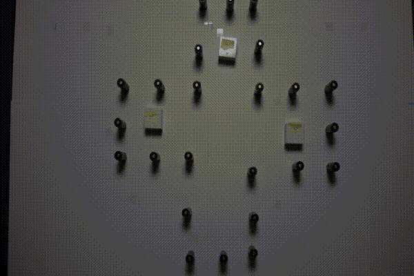
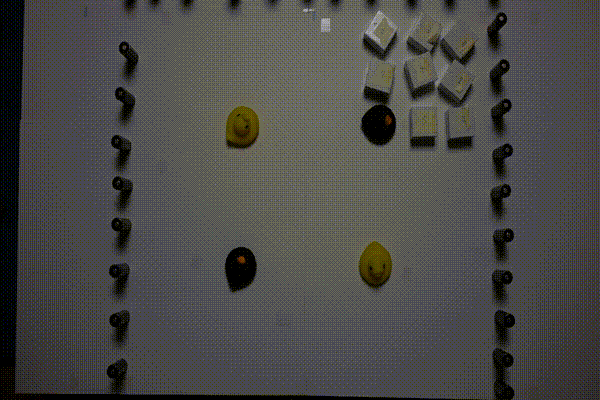

toio-tswap
---
[](LICENSE)

Online TSWAP implementation using the [toio](https://toio.io/) robots.
It is mainly written in Node.js with [yarn](https://yarnpkg.com/) build and uses C++(17) with [CMake](https://cmake.org/) (v≥v3.16) build for the target assignment.
The implementation also includes MCPs [1].
They are tested on MacOS 10.15.

## Demo




## Requirements
- [toio](https://toio.io/)
- [yarn](https://yarnpkg.com/)
- [CMake](https://cmake.org/) (v≥v3.16)

## Install
```sh
git clone --recursive https://github.com/Kei18/toio-tswap.git
cd toio-tswap
yarn install
yarn build
cmake -B build ./target_assignment/
make -C build
```

## Usage
- Step1: Switch on your toio robots
- Step2: Get the id of the toio robots
```sh
yarn run get_id 3
```
- Step3: Edit the id in the problem file `./sample/problem.yaml`
- Step4: You may also need to adjust coordinates, see `./sample/graph.yaml`
- Step5: Set the toio robots in appropriate positions
- Step6: Execute!
```sh
yarn run tswap ./sample/graph.yaml ./sample/problem.yaml
```

You can also run MCPs. Do not forget to edit the id in `./sample/plan.yaml`:
```sh
yarn run mcps ./sample/graph.yaml ./sample/plan.yaml
```

## Experimental Setting
The initial demo is in `sample/`.
For the others, see `exp_settings/`.
I make the id of toio nonpublic, so you have to change the id when you test the settings.
Note that the demo with delays is not included but it is easy to do so by modifying `src/common.js`.

## Licence
This software is released under the MIT License, see [LICENCE.txt](LICENCE.txt).

## Notes
- This repository is forked from [toio.js](https://github.com/toio/toio.js). To make the repo private temporarily, I duplicated the original repo.
- The target assignment algorithm uses the Dijkstra algorithm instead of BFS. Therefore, the code is not limited to the grid environment, rather, it can work on graphs with non-uniform edge costs.
- To convert data from the [unlabeled-MAPF repo](https://kei18.github.io/unlabeled-MAPF), see `notebooks/`. I prepared example codes written in Python (Jupyter Notebook).

## Author
[Keisuke Okumura](https://kei18.github.io) is a Ph.D. student at the Tokyo Institute of Technology, interested in controlling multiple moving agents.

## Reference
1. Ma, H., Kumar, T. K., & Koenig, S. (2016). Multi-agent path finding with delay probabilities. arXiv preprint arXiv:1612.05309.
