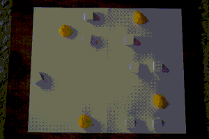

toio-tswap
---

[](LICENSE)

[PIBT](https://kei18.github.io/pibt2) implementation with the [toio](https://toio.io/) robots.

- It is written in Node.js with [yarn](https://yarnpkg.com/) build
- They are tested on MacOS 10.15.

## Demo



## Install
```sh
git clone https://github.com/Kei18/toio-pibt.git
cd toio-pibt
yarn install
yarn build
```

## Usage
- Step1: Create your test field. An example is available on `./sample/7x5.yaml`.
  - To convert maps of https://movingai.com/benchmarks/ to YAML one, `./notebooks/graph_gen.ipynb` might be useful
  - To obtain coordinates of the playmat, `yarn loc` might help you, which obtains coordinates using one toio robot.
- Step2: Switch on your toio robots and Bluetooth of your PC
- Step3: Execute!

```sh
yarn pibt {the number of robots}
```

## Experimental Setting
[](https://github.com/Kei18/toio-pibt/releases/tag/v1.0)

## Licence
This software is released under the MIT License, see [LICENCE.txt](LICENCE.txt).

## Notes
- This repository is forked from [toio.js](https://github.com/toio/toio.js). To make the repo private temporarily, I duplicated the original repo.

## Author
[Keisuke Okumura](https://kei18.github.io) is a Ph.D. student at the Tokyo Institute of Technology, interested in controlling multiple moving agents.
